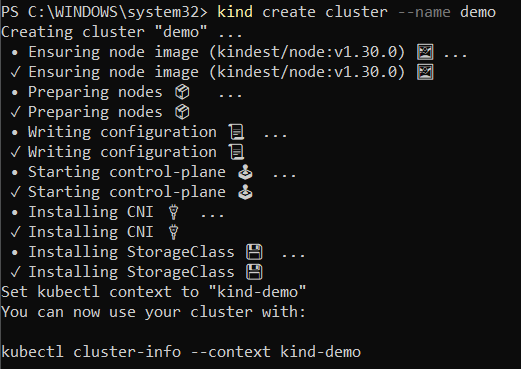

# Verificación del funcionamiento de Docker, Docker, Desktop, Minikube, Kind
## Objetivos
- Entender las diferencias fundamentales entre la virtualización tradicional y la contenerización, y
cómo Docker revoluciona el desarrollo y la implementación de aplicaciones mediante la creación
de entornos ligeros y portátiles.

- Aprender a instalar y configurar Docker y Docker Desktop en Linux y cómo pueden facilitar el
desarrollo y la distribución de aplicaciones.

- Entender los conceptos básicos de Kubernetes como sistema de orquestación de contenedores,
y aprender a utilizar Minikube y Kind para crear y gestionar clústeres de Kubernetes en un
entorno local. Esto incluye comprender la arquitectura de Kubernetes, los objetos de
Kubernetes (pods, servicios, despliegues, etc.) y cómo se pueden manejar a través de estas
herramientas. 

### Prueba de Docker Engine
1. Descarga e instala Docker Desktop: https://docs.docker.com/desktop/install/ubuntu/

En este caso se hara en el SO de windows: https://docs.docker.com/desktop/install/windows-install/


2. Ahora que has instalado Docker Desktop con éxito, hay que probar. Comienza ejecutando un
   contenedor Docker simple directamente desde la línea de comando. Abre una ventana de
   Terminal y ejecuta el siguiente comando:

```$ docker version```


3. Para ver si puedes ejecutar contenedores, ingresa el siguiente comando en la ventana de
   Terminal y presiona Enter:

```   $ docker container run hello-world```
  
Si lees atentamente el resultado anterior, habrás notado que Docker no encontró una imagen
   llamada hello-world:latest y, por lo tanto, decidió descargarla desde un registro de imágenes de
   Docker. Una vez descargado, Docker Engine creó un contenedor a partir de la imagen y lo
   ejecutó. La aplicación se ejecuta dentro del contenedor y luego genera todo el texto,
   comenzando con Hello from Docker!
   Esta es una prueba de que Docker está instalado y funcionando correctamente en tu máquina.


4. Prueba con otra imagen de prueba divertida que normalmente se usa para verificar la
   instalación de Docker. Ejecuta el siguiente comando:

```   $ docker container run rancher/cowsay Hello```


Genial: has confirmado que Docker Engine funciona en tu computadora local. Ahora, aseguráte de que
lo mismo ocurre con Docker Desktop.


### Habilitar Kubernetes en Docker Desktop

Instalación de Docker Desktop: https://docs.docker.com/desktop/install/linux-install/

Docker Desktop viene con soporte integrado para Kubernetes.


### Probando minikube y kubectl

Descarga e instala y minikube https://minikube.sigs.k8s.io/docs/start/ 


y kubectl https://kubernetes.io/docs/tasks/tools/install-kubectl-linux/


1. Intenta acceder al clúster usando kubectl. Primero, debes asegurarte de tener seleccionado el
   contexto correcto para kubectl. Si anteriormente instalastes Docker Desktop y ahora minikube, puedes
   usar el siguiente comando:
```  $ kubectl config get-contexts```
   El asterisco al lado del contexto (verifica esto) llamado minikube te dice que este es el contexto actual.
   Así, al usar kubectl, se trabajará con el nuevo cluster creado por minikube.


2. Ahora veamos cuántos nodos tiene tu cluster con este comando:
   kubectl get nodes
``````

3. Ahora, intenta ejecutar algo en este clúster. Usaremos Nginx, un servidor web popular para esto.
   Utiliza el archivo .yaml, que acompaña a la actividad que vas a utilizar para esta prueba:
   Abre una nueva ventana de Terminal y crea un pod que ejecute Nginx con el siguiente comando:
```   $ kubectl apply -f nginx.yaml```
   pod/nginx created


4. Puedes verificar si el pod se está ejecutando con kubectl:
```   $ kubectl get pods```

5. Para acceder al servidor Nginx, necesitas exponer la aplicación que se ejecuta en el pod con el
   siguiente comando:
```   $ kubectl expose pod nginx --type=NodePort --port=80```

   Esta es la única forma en que puedes acceder a Nginx desde tu computadora, por ejemplo, a través de
   un navegador. Con el comando anterior, estás creando un servicio de Kubernetes, como se indica en el
   resultado generado para el comando:
``` service/nginx exposed```
   

6. Podemos usar kubectl para enumerar todos los servicios definidos en el clúster:
```   kubectl get services```


7. Ahora, puedes usar minikube para crear un túnel hacia el clúster y abrir un navegador con la URL
   correcta para acceder al servidor web Nginx. Utiliza este comando:
```   $ minikube service nginx```   
   El resultado en tu ventana de terminal será el siguiente:


El resultado anterior muestra que minikube creó un túnel para el servicio nginx que escucha en el puerto
del nodo 30432 que está en nuestra computadora portátil.
Has ejecutado y accedido con éxito a un servidor web Nginx en un clúster de Kubernetes de un solo
nodo en minikube! Una vez que hayas terminado de jugar, es hora de limpiar:
- Detén el túnel hacia el clúster presionando Ctrl + C dentro de la ventana de Terminal.
- Elimina el servicio nginx y el pod en el clúster: $ kubectl delete service nginx
```$ kubectl delete pod nginx```
- Detén el clúster con el siguiente comando: minikube stop


### Ejercicios
A veces, probar con un clúster de un solo nodo no es suficiente. minikube lo resuelve. Sigue estas
instrucciones para crear un verdadero clúster de Kubernetes de múltiples nodos en minikube:

1. Si quieres trabajar con un clúster que consta de varios nodos en minikube, podemos usar este
   comando:
```   $ minikube start --nodes 3 –p demo```
   El comando anterior crea un clúster con tres nodos y lo llamas demo.


2. Utiliza kubectl para enumerar todos los nodos de tu clúster:
```   $ kubectl get nodes ```

Tenemos un clúster de 3 nodos donde el nodo demo es un nodo maestro y los dos nodos restantes son
nodos de trabajo.
3. No vamos a continuar con este ejemplo aquí, así que usa el siguiente comando para detener el
   clúster:
```   $ minikube stop -p demo ```

4. Elimina todos los clústeres de su sistema con este comando:
```   $ minikube delete –all```

   Esto eliminará el clúster predeterminado (llamado minikube) y el clúster demo en nuestro caso.
   Con esto, pasaremos a la siguiente herramienta interesante y útil a la hora de trabajar con contenedores
   y Kubernetes. Deberías tenerlo instalado y disponible en la computadora de tu trabajo.

### Kind
Kind (https://kind.sigs.k8s.io/docs/user/quick-start) es otra herramienta popular que se puede utilizar
para ejecutar un clúster de Kubernetes de múltiples nodos localmente en tu máquina. Es muy fácil de
instalar y usar.
Vamos:

1. En una máquina Linux, puedes usar el siguiente script para instalar Kind desde sus archivos binarios:
   curl -Lo ./kind https://kind.sigs.k8s.io/dl/v0.22.0/kind-linux-amd64
```   $chmod +x ./kind```
```   $sudo mv ./kind /usr/local/bin/kind```

En este caso lo instalare en windows con chocolatey


2. Una vez instalado Kind, pruébalo con el siguiente comando:
```   $ kind version```


3. Ahora, intenta crear un clúster de Kubernetes simple que consta de un nodo maestro y dos nodos
   trabajadores. Utiliza este comando para lograr esto:
```   $ kind create cluster```


4. Para verificar que se ha creado un clúster, utiliza este comando:
```   $ kind get clusters```


5. Podemos crear un clúster adicional con un nombre diferente usando el parámetro --name, así:
 ```  $ kind create cluster --name demo```

6. Enumera los clústeres
```   $ kind get clusters```

   Ahora podemos usar kubectl para acceder y trabajar con los clústeres que acabamos de crear. Mientras
   creaba un clúster, Kind también actualizó el archivo de configuración del kubectl. Podemos verificar esto
   con el siguiente comando:
```   $ kubectl config get-contexts```
   Puedes ver que los clústeres kind y de demo son parte de la lista de clústeres conocidos y que el clúster
   de demo es el contexto actual para kubectl (comprueba).


7. Utiliza el siguiente comando para convertir el clúster de demo en tu clúster actual si el asterisco indica
   que hay otro clúster actual:
```   $ kubectl config use-context kind-demo```


8. Enumera todos los nodos del clúster de muestra:
```   $ kubectl get nodes ```


4. Ahora, intenta ejecutar el primer contenedor en este clúster. Usa el servidor web Nginx de confianza,
   como hicistes antes. Utiliza el siguiente comando para ejecutarlo:
```   $ kubectl apply -f nginx.yaml```
   El resultado debería ser el siguiente:
   pod/nginx created


5. Para acceder al servidor Nginx, necesitas realizar el reenvío de puertos usando kubectl. Utiliza este
   comando para hacerlo:
```   $ kubectl port-forward nginx 8080 80 (puedes usar otros puertos)```
   Revisa: kubectl describe pod nginx, https://www.kristhecodingunicorn.com/post/kubernetes-portforwarding-cleanup-of-orphaned-ports/
   Abra una nueva pestaña del navegador y navega hasta http://localhost:8080; Deberías ver la pantalla de
   bienvenida de Nginx.


   Una vez que hayas terminado de jugar con Nginx, usa este comando para eliminar el pod del clúster:
```   $ kubectl delete -f nginx.yaml```


   Antes de continuar, limpiemos y eliminemos los dos clústeres que acabamos de crear:
   ```   $ kind delete cluster --name kind```
   ```   $ kind delete cluster --name demo```
   Con esto, has instalado todas las herramientas que necesitaremos para trabajar exitosamente con
   contenedores en tu máquina local.
 

### Preguntas
   Con base en lo que se cubrió en esta actividad, responde las siguientes preguntas:

1. En tus propias palabras, usando analogías, explica qué es un contenedor.
   
   Un contenedor es como un recipiente virtual que encapsula una aplicación junto con todas sus dependencias y configuraciones necesarias para ejecutarse de manera consistente en cualquier entorno.

2. ¿Por qué se considera que los contenedores cambian las reglas del juego en IT? Menciona tres o
   cuatro razones.

   Los contenedores son disruptivos en la industria de IT por varias razones:

- **Portabilidad:** Un contenedor empacado con una aplicación funcionará de la misma manera en cualquier entorno, desde el desarrollo hasta la producción, eliminando inconsistencias entre diferentes ambientes.

- **Escalabilidad:** Los contenedores permiten escalar aplicaciones de manera rápida y eficiente, respondiendo dinámicamente a cambios en la carga de trabajo.

- **Eficiencia:** Al compartir recursos del sistema operativo subyacente y arrancar rápidamente, los contenedores permiten un uso eficiente de la infraestructura y reducen los costos operativos.

- **Desarrollo Ágil:** Facilitan la entrega continua y la integración continua (CI/CD), acelerando el ciclo de desarrollo y mejorando la colaboración entre equipos de desarrollo y operaciones.

3. ¿Qué significa cuando afirmamos que, si un contenedor se ejecuta en una plataforma
   determinada, entonces se ejecutará en cualquier lugar? Menciona dos o tres razones por las que
   esto es cierto.

   Esto significa que un contenedor, creado y probado en un entorno específico (por ejemplo, localmente en tu máquina de desarrollo), funcionará de manera consistente en cualquier otro entorno donde se ejecute Docker.

4. ¿Es verdadera o falsa la siguiente afirmación: los contenedores Docker solo son útiles para
   aplicaciones modernas y totalmente nuevas basadas en microservicios? Por favor justifica tu
   respuesta.

   **Falsa.** 
Los contenedores Docker son útiles para una amplia variedad de aplicaciones, tanto nuevas como existentes, 
monolíticas o basadas en microservicios. Docker ofrece flexibilidad y beneficios como la portabilidad y 
la eficiencia de recursos, que son valiosos para cualquier tipo de aplicación. Además, Docker permite la 
modernización de aplicaciones existentes al facilitar la migración y el despliegue en contenedores 
sin necesidad de reescribir completamente el código.
 
5. ¿Por qué nos importaría instalar y usar un administrador de paquetes en nuestra computadora local?
   Un administrador de paquetes, como apt en Ubuntu o Homebrew en macOS, facilita la instalación, actualización y gestión de software y bibliotecas en nuestra máquina local. Esto es importante porque:

   - Simplifica la instalación de herramientas y dependencias necesarias para el desarrollo y la operación de aplicaciones.
   - Ayuda a mantener el software actualizado con las últimas versiones y parches de seguridad.
   - Permite la gestión de múltiples versiones de software y la resolución de dependencias de manera eficiente.

6. ¿Con Docker Desktop, puede desarrollar y ejecutar contenedores de Linux?
   
    Sí, Docker Desktop permite el desarrollo y la ejecución de contenedores tanto de Linux como de Windows en sistemas operativos compatibles. Utiliza Hyper-V en Windows y máquinas virtuales en macOS para ejecutar contenedores Linux de manera nativa.

7. ¿Por qué son esenciales buenas habilidades de programación (como Bash o PowerShell) para el uso productivo de los contenedores?

   Las habilidades de programación son esenciales para trabajar eficientemente con contenedores por varias razones:

   - Automatización: Scripting en Bash, PowerShell u otros lenguajes permite automatizar tareas repetitivas como la construcción de imágenes, la gestión de contenedores y el despliegue.
   - Depuración y diagnóstico: Permite la depuración y el diagnóstico eficaz de problemas en contenedores mediante el análisis de logs, ejecución de comandos dentro de contenedores, etc.
   - Personalización: Facilita la personalización y configuración avanzada de entornos de desarrollo y despliegue basados en contenedores.

8. Nombra tres o cuatro distribuciones de Linux en las que Docker esté certificado para ejecutarse.

   - Ubuntu
   - CentOS
   - Red Hat Enterprise Linux (RHEL)
   - Debian
9. Instalaste minikube en tu sistema. ¿Para qué tipo de tareas utilizarás esta herramienta?

   Minikube se utiliza principalmente para facilitar el desarrollo y la prueba locales de aplicaciones en entornos de Kubernetes.