# Introducción a Docker
## Docker para otras distribuciones de Linux
Docker es compatible con la mayoría de las distribuciones y arquitecturas de Linux. Para obtener más
información, consulta la página oficial en https://docs.docker.com/engine/install/.
Probando la instalación de Docker (opcional)
Independientemente de la instalación que haya elegido (macOS, Windows, Ubuntu, Linux u otra),
Docker debe estar configurado y listo. La mejor manera de probarlo es ejecutar el comando docker info.
El mensaje de salida debe ser similar al siguiente:
$ docker info
Containers: 0
Running: 0
Paused: 0
Stopped: 0
Images: 0
...

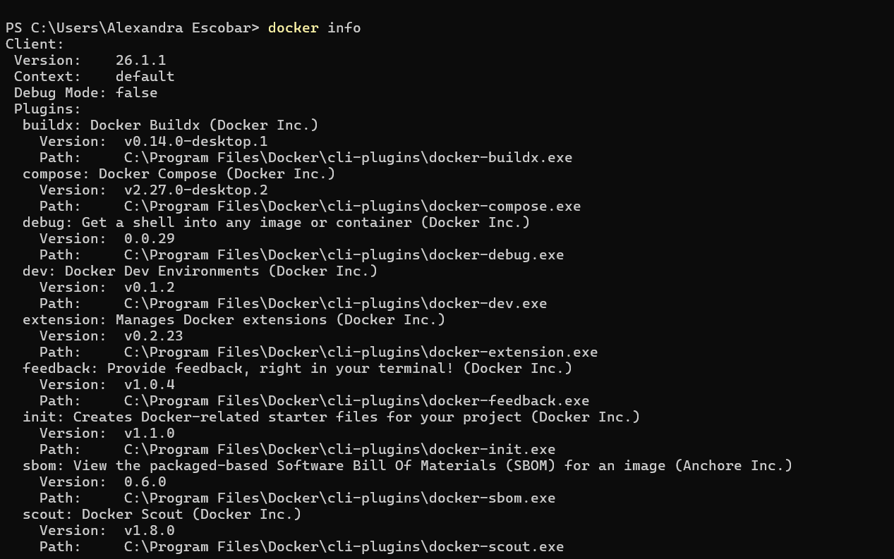
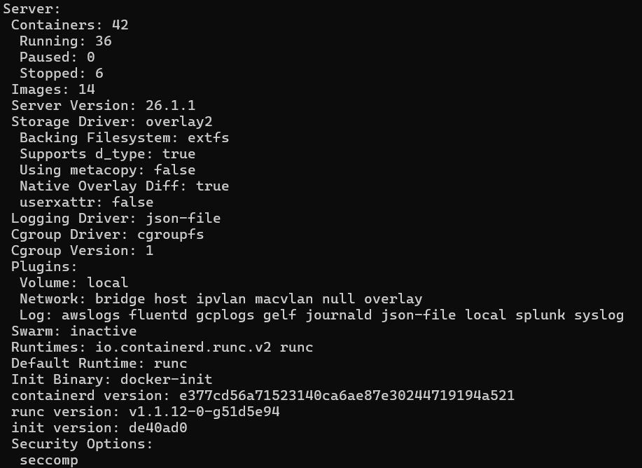

## Instalación en un servidor

Para usar Docker en la red, es posible aprovechar los proveedores de plataformas en la nube o instalar
Docker manualmente en un servidor dedicado. En el primer caso, la configuración de Docker difiere de
una plataforma a otra, pero siempre está muy bien descrita en tutoriales dedicados. La mayoría de las
plataformas en la nube permiten la creación de Docker hosts a través de interfaces web fáciles de usar o
describen comandos exactos para ejecutar en sus servidores.
Sin embargo, el segundo caso (instalación manual de Docker y) requiere algunas palabras. 

## Servidor dedicado
La instalación manual de Docker en un servidor no difiere mucho de la instalación local. Se requieren
dos pasos adicionales, que incluyen configurar el demonio Docker para escuchar en el socket de la red y
configurar certificados de seguridad. Estos pasos se describen con más detalle aquí: 

Por defecto, por motivos de seguridad, Docker se ejecuta a través de un socket Unix fuera de la red que
solo permite la comunicación local. Es necesario agregar escucha en el socket de la interfaz de red
elegida para que los clientes externos puedan conectarse. En el caso de Ubuntu, el daemon de Docker es
configurado por systemd, entonces, para cambiar la configuración de cómo se inicia, necesitamos
modificar una línea en el archivo /lib/systemd/system/docker.service, de la siguiente manera: 

ExecStart=/usr/bin/dockerd -H <server_ip>:2375

Al cambiar esta línea, habilitamos el acceso al demonio Docker a través de la dirección IP (Protocolo de
Internet) especificada. Todos los detalles sobre la configuración de systemd se pueden encontrar en
https://docs.docker.com/config/daemon/systemd/.

Este paso de la configuración del servidor se refiere a los certificados de seguridad de Docker. Esto
permite que solo los clientes autenticados por un certificado accedan al servidor. Puedes encontrar una
descripción completa de la configuración del certificado de Docker en
https://docs.docker.com/engine/security/protect-access/. 

Este paso no es estrictamente necesario; sin
embargo, a menos que tu servidor demonio Docker esté dentro de una red con firewall, es esencial.

Información :

Si tu demonio Docker se ejecuta dentro de una red corporativa, debe configurar el proxy del Protocolo
de transferencia de hipertexto (HTTP). Puedes encontrar una descripción detallada en
https://docs.docker.com/config/daemon/systemd/.

El entorno de Docker está configurado y listo, por lo que podemos comenzar con el primer ejemplo.


Ejecutando Docker hello-world

Ingresa el siguiente comando en su consola:

$ docker run hello-world

Unable to find image 'hello-world:latest' locally
latest: Pulling from library/hello-world
1b930d010525: Pull complete
Digest: sha256:2557e3c07ed1e38f26e389462d03ed943586f744621577a99efb77324b0fe535
Status: Downloaded newer image for hello-world:latest
Hello from Docker!
This message shows that your installation appears to be working
correctly.
...

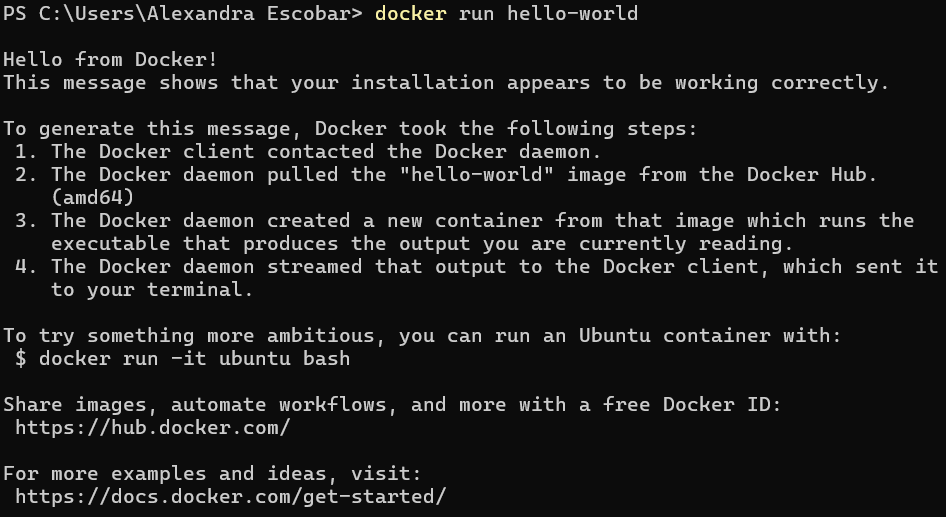

¡Felicidades! Acaba de ejecutar tu primer contenedor Docker. Espero que ya puedas ver lo simple que es
Docker. Examinemos lo que sucedió, de la siguiente manera:

Pregunta 1: Explica el procedimiento realizado en esta ejecución por línea de comandos.

### Componentes Docker
Instalar Docker significa instalar todos los componentes para que el demonio Docker se ejecute en un
equipo todo el tiempo como un servicio. En el caso del ejemplo de hello-world, usamos el cliente de
Docker para interactuar con el demonio de Docker; sin embargo, podríamos hacer exactamente lo
mismo usando API REST. Además, en el caso del ejemplo de hello-world, nos conectamos al demonio
Docker local. Sin embargo, podríamos usar el mismo cliente para interactuar con el demonio Docker que
se ejecuta en una máquina remota.
Sugerencia: para ejecutar el contenedor Docker en una máquina remota, puedes usar la opción -H:

docker -H <server_ip>:2375 run hello-world. 

### Imágenes y contenedores Docker
Una imagen es un bloque de construcción sin estado (stateless) en el mundo de Docker. Puedes pensar
en una imagen como una colección de todos los archivos necesarios para ejecutar tu aplicación, junto
con los pasos sobre cómo ejecutarla. Una imagen no tiene estado, por lo que puedes enviarla a través
de la red, almacenarla en el registro, nombrarla, versionarla y guardarla como un archivo. Las imágenes
están en capas, lo que significa que puedes construir una imagen encima de otra imagen.

Un contenedor es una instancia en ejecución de una imagen. Podemos crear muchos contenedores a
partir de una misma imagen si queremos tener muchas instancias de la misma aplicación.

Dado que los contenedores tienen estado (stateful) podemos interactuar con ellos y realizar cambios en
sus estados. 

### Aplicaciones docke
Se proporcionan muchas aplicaciones en forma de imágenes de Docker que se pueden descargar de
Internet. Si conocemos el nombre de la imagen, bastaría con ejecutar de la misma forma que hicimos
con el ejemplo de hello-world. ¿Cómo podemos encontrar la imagen de la aplicación deseada en Docker
Hub? 

### Creación de imágenes de Docker 

En esta sección, veremos cómo crear imágenes de Docker utilizando dos métodos diferentes: el
comando commit de Docker y una compilación automatizada de Dockerfile.
docker commit
Comencemos con un ejemplo y preparemos una imagen con los kits de herramientas de Git y JDK.
Usaremos Ubuntu 20.04 como imagen base. No hay necesidad de crearlo; la mayoría de las imágenes
base están disponibles en el registro de Docker Hub. Procede de la siguiente:

1. Ejecuta un contenedor desde ubuntu:20.04 y conéctalo a tu línea de comando, así:

```$ docker run -i -t ubuntu:20.04 /bin/bash```

Extrajimos la imagen de ubuntu:20.04, la ejecutamos como un contenedor y luego llamamos al
comando /bin/bash de forma interactiva (marca -i).

Deberías ver la Terminal del contenedor. Dado que los contenedores tienen estado y escritura, podemos
hacer lo que queramos en el Terminal.

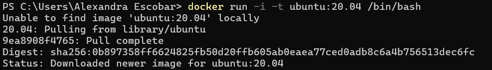

2. Instala el kit de herramientas de Git de la siguiente manera:

```root@dee2cb192c6c:/# apt-get update```

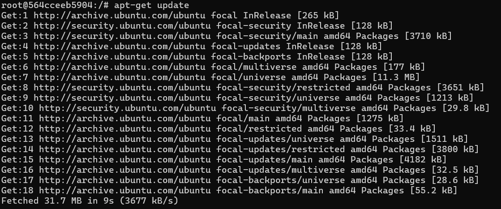

```root@dee2cb192c6c:/# apt-get install -y git```

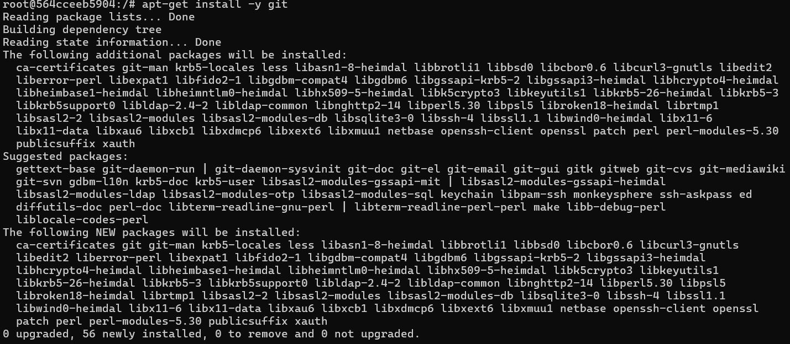

3. Comprueba si el kit de herramientas de Git está instalado ejecutando lo siguiente:

```root@dee2cb192c6c:/# which git```


```/usr/bin/git```

4. Sal del contenedor, así:

```root@dee2cb192c6c:/# exit```

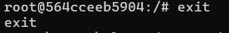

5. Verifica qué ha cambiado en el contenedor comparando su identificador (ID) de contenedor único con
la imagen de ubuntu, de la siguiente manera:

```$ docker diff dee2cb192c6c```

El comando anterior debe imprimir una lista de todos los archivos modificados en el contenedor.

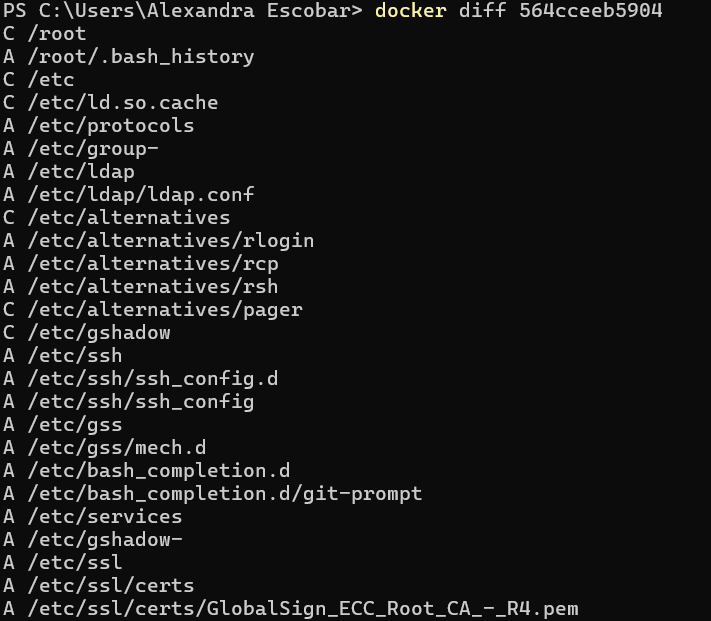


6. Commit el contenedor a la imagen, así:

```$ docker commit dee2cb192c6c ubuntu-git```

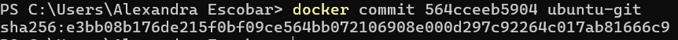

Acabamos de crear nuestra primera imagen de Docker. Enumeremos todas las imágenes del host Docker
para ver si la imagen está presente, de la siguiente manera:

```$docker images```

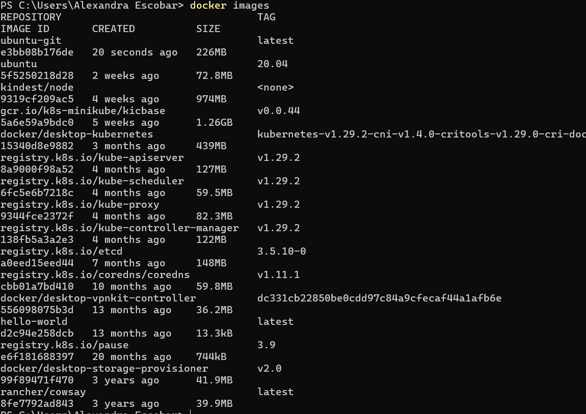
Pregunta: ¿que resultado encuentras después de ejecutar el comando?, ¿aparece la imagen ubuntugit?, ¿cuál es su tamaño? 

Ahora, si creamos un contenedor a partir de la imagen, tendrás instalada la herramienta Git, como se
ilustra en el siguiente fragmento de código:

```$ docker run -i -t ubuntu-git /bin/bash```

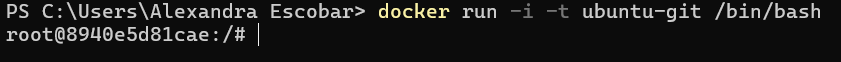

```root@3b0d1ff457d4:/# which git```

```/usr/bin/git```

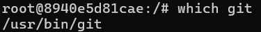

```root@3b0d1ff457d4:/# exit```

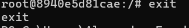

### Dockerfile
Crear de manera manual cada imagen de Docker con el comando commit podría ser laborioso,
especialmente en el caso de la automatización de compilación y el proceso de entrega continua (CD).
Afortunadamente, hay un lenguaje incorporado para especificar todas las instrucciones que deben
ejecutarse para crear una imagen de Docker.
Comencemos con un ejemplo similar al de Git. Esta vez, prepararemos una imagen de ubuntu-python,
de la siguiente manera:

1. Crea un nuevo directorio y un archivo llamado Dockerfile con el siguiente contenido: 

```FROM ubuntu:20.04
RUN apt-get update && \
apt-get install -y python 
```

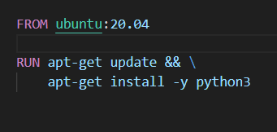

2. Ejecuta el siguiente comando para crear una imagen ubuntu-python:

```$ docker build -t ubuntu-python```
.

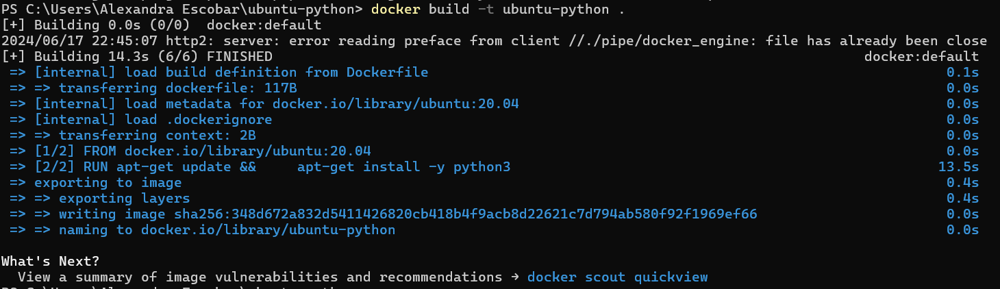

3. Comprueba que la imagen se creó ejecutando el siguiente comando:

```$ docker images```

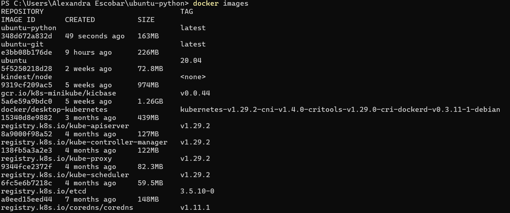

### Aplicación Docker completa

Ya tenemos toda la información necesaria para crear una aplicación completamente funcional como una
imagen de Docker. Como ejemplo, prepararemos, paso a paso, un programa simple de Python helloworld. Los pasos son siempre los mismos, independientemente del entorno o lenguaje de programación
que utilicemos.
Esta es una aplicación muy simple, así que no deberías tener problemas con resolverla

**Escribiendo la aplicación**

Crea un nuevo directorio y, dentro de este directorio, crea un archivo hola.py con el siguiente
contenido:

print "¡Hola mundo desde Python!"

Cierra el archivo. Este es el código fuente de nuestra aplicación.
Preparando el entorno

El entorno se expresa en el Dockerfile. Necesitamos instrucciones para definir lo siguiente:

• ¿Qué imagen base debe usarse?

• ¿Cómo instalar el intérprete de Python?

• ¿Cómo incluir hello.py en la imagen?

• ¿Cómo iniciar la aplicación? 

En el mismo directorio, crea el Dockerfile, así:
```
FROM ubuntu:20.04
RUN apt-get update && \
apt-get install -y python
COPY hola.py .
ENTRYPOINT ["python", "hola.py"]
```

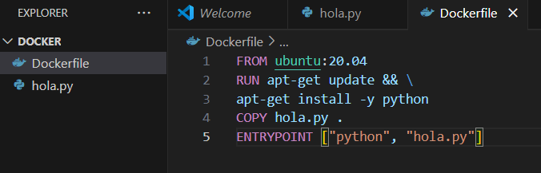

**Construyendo la imagen**

Ahora, podemos construir la imagen exactamente de la misma manera que lo hicimos antes, de la
siguiente manera:

```$ docker build -t hola-python .```

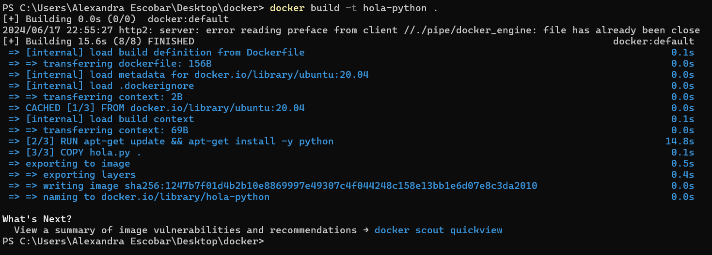

**Ejecutando la aplicación**

Ejecutamos la aplicación ejecutando el contenedor, así:

```$ docker run hola-python``` 

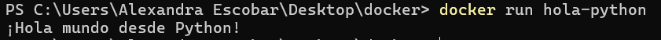

**Ejercicio:** Este simple este ejercicio te guiará a través del proceso de configuración y ejecución de una
simple aplicación cliente-servidor utilizando Python y Docker. El objetivo es aprender cómo los
contenedores Docker pueden ser utilizados para desplegar aplicaciones de manera aislada y eficiente. 