# Configuración de docker
```
# Usar una imagen base de OpenJDK
FROM openjdk:21

# Establecer el directorio de trabajo dentro del contenedor
WORKDIR /app

# Copiar todo el contenido del directorio actual a /app en el contenedor
COPY . /app/

# Compilar todos los archivos Java en el directorio de origen
RUN javac src/main/java/org/example/*.java

# Definir el comando por defecto para ejecutar la aplicación
CMD ["java", "-cp", "src/main/java", "org.example.Game"]
```
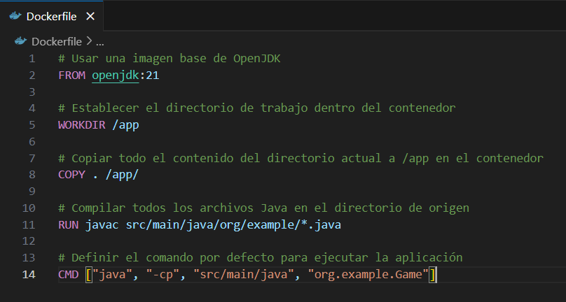

# Construcción de la imagen Docker
```docker build -t tower-defense-game .```

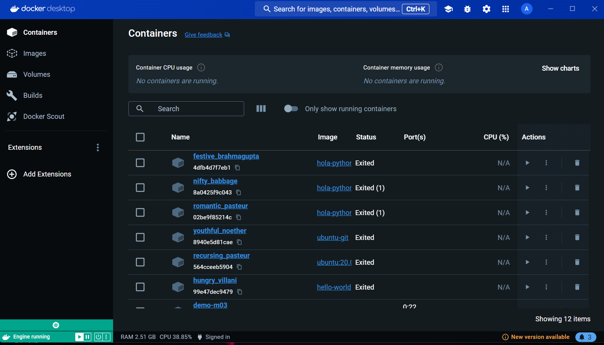

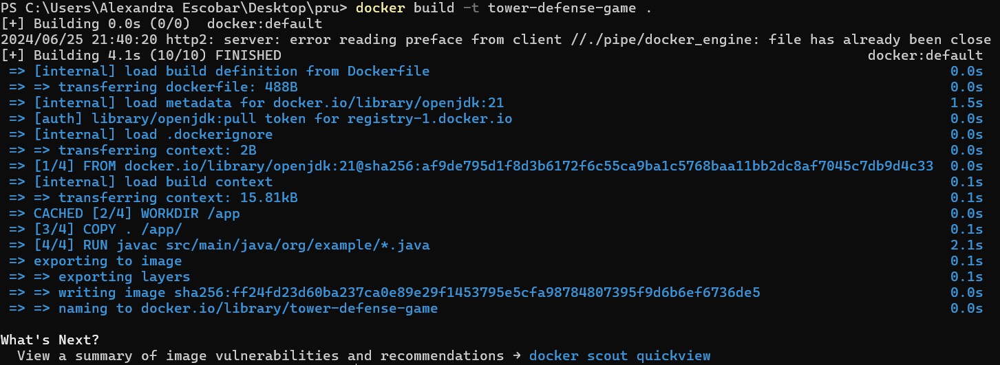
# Ejecución del contenedor
```docker run -it --name tower-defense-container tower-defense-game```
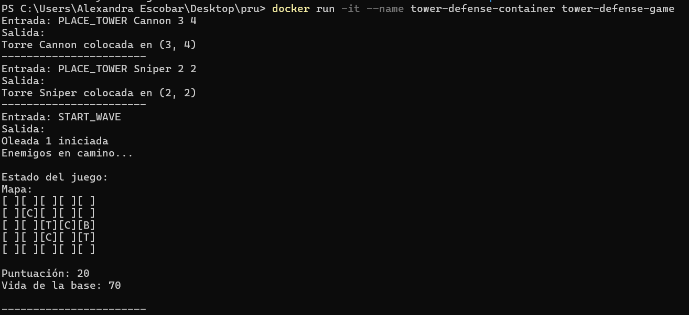
# Configuración de redes y volúmenes en Docker
## Crear una red personalizada
```docker network create game-network```
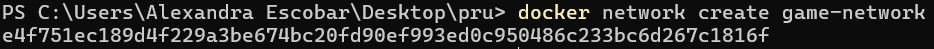
## Ejecutar el contenedor en la red
```docker run -it --name tower-defense-container --network game-network tower-defense-game```
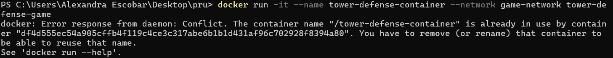
```docker rm tower-defense-container```


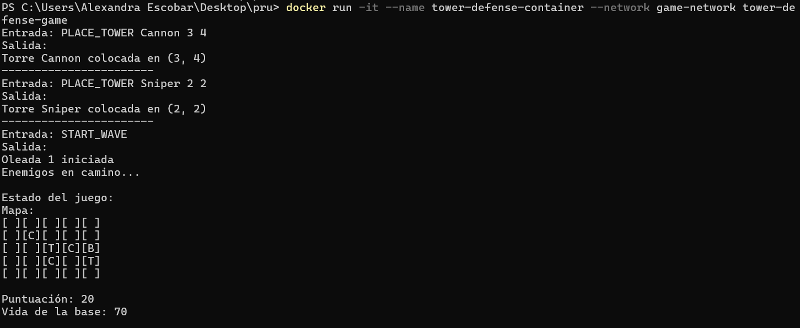


## Crear y montar un Volumen
```docker volume create game-data```
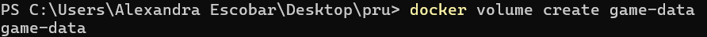
```docker run -it --name tower-defense-container --network game-network -v game-data:/app/data towerdefense-game```
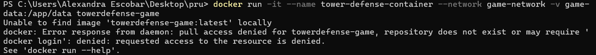
```docker rm tower-defense-container```
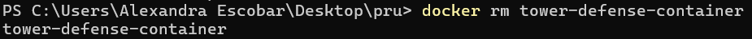
```docker run -it --name tower-defense-container --network game-network -v game-data:/app/data e318f11cb88b2320c6ca6c89c99cdfd1bdc55ded682518df595a2b031a40fef6```
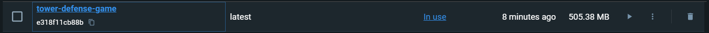

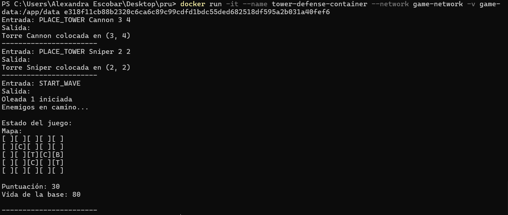
# Interacción con contenedores usando docker exec
## Acceder al contenedor en ejecución
```docker exec -it tower-defense-container /bin/bash```
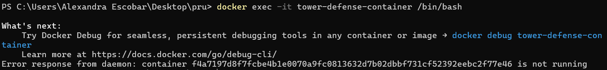
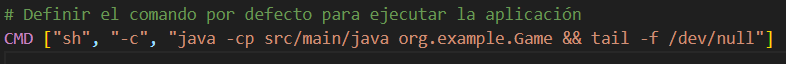
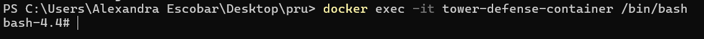

## Ejecutar comandos dentro del contenedor
ls /app

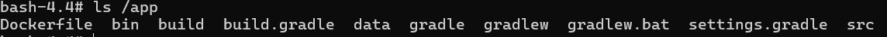

# Implementación con Docker Compose
## Crear un archivo docker-compose.yml
```version: '3'
services:
 game:
 image: tower-defense-game
 networks:
 - game-network
 volumes:
 - game-data:/app/data
networks:
 game-network:
 driver: bridge
volumes:
 game-data:
 driver: local
 ```

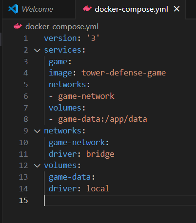
## Iniciar los servicios

```docker-compose up -d```
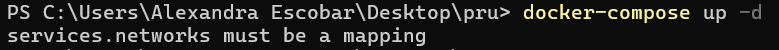
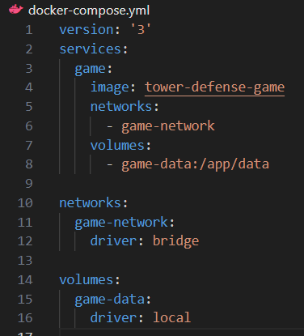
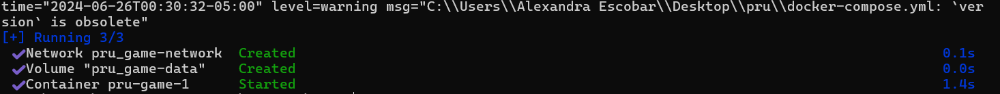

# Despliegue en Kubernetes
## Crear archivos de despliegue y servicio 
### deployment.yaml
```apiVersion: apps/v1
kind: Deployment
metadata:
 name: tower-defense-deployment
spec:
 replicas: 1
 selector:
 matchLabels:
 app: tower-defense-game
 template:
 metadata:
 labels:
 app: tower-defense-game
 spec:
 containers:
 - name: tower-defense-game
 image: tower-defense-game
 ports:
 - containerPort: 8080
 ```
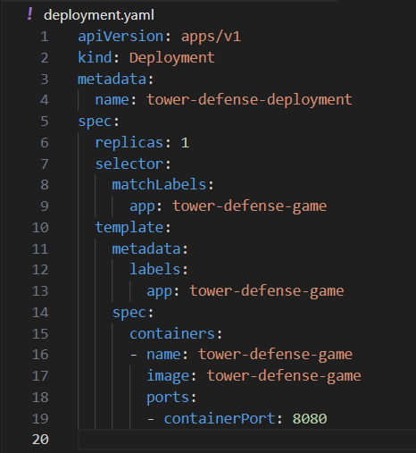
### service.yaml
 ```
 yaml
apiVersion: v1
kind: Service
metadata:
 name: tower-defense-service
spec:
 selector:
 app: tower-defense-game
 ports:
 - protocol: TCP
 port: 80
 targetPort: 8080
 type: LoadBalancer 
 ```
 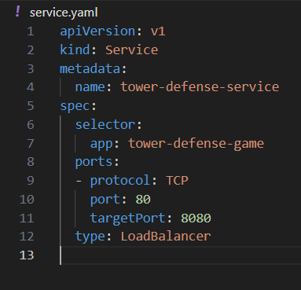

### Aplicar los archivos de configuración en Kubernetes
 ```kubectl apply -f deployment.yaml ```
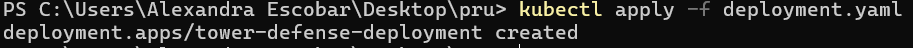
 ```kubectl apply -f service.yaml ```
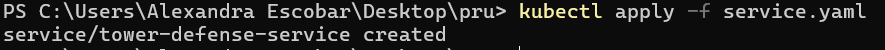
### Verificar el estado del despliegue
 ```kubectl get pods ```
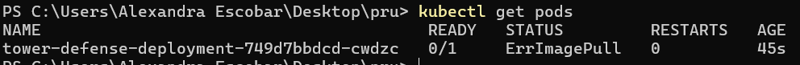
 ```kubectl get services ```
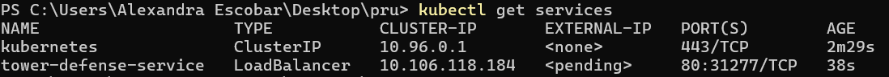